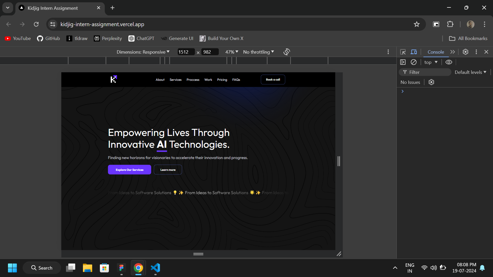

# Kidjig Intern Assignment

Welcome to the Kidjig Intern Assignment project.

## Getting Started

To get started, first install dependencies and run the development server:

## SCREENSHOT



```bash
npm install
# or
yarn install
#or
bun install


npm run dev
# or
yarn dev
# or
pnpm dev
# or
bun dev
```
